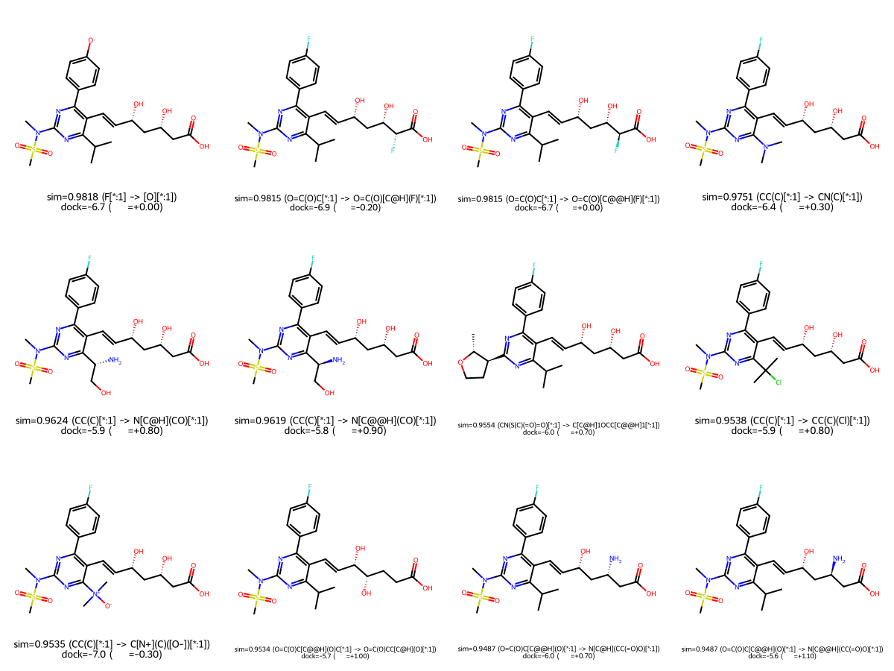

# bioisostere_assist

A CafChem project.

Finds shape-bioisosteric substituent fragments — pieces of a molecule that
could be swapped for something else while preserving 3D shape (and
optionally pharmacophore/electrostatic character) at the attachment point.
Built entirely on open-source tools: **RDKit for fragmentation and
conformer generation, ODDT for the 3D shape descriptors.**

## Contents

- [How it works](#how-it-works)
- [Library storage and the "new lead" workflow](#library-storage-and-the-new-lead-workflow)
- [Data](#data)
- [Installation](#installation)
- [Usage](#usage)
  - [Building your own library (optional)](#building-your-own-library-optional)
  - [Querying a new lead against the library](#querying-a-new-lead-against-the-library)

## How it works

1. **Fragment** (`code/fragment.py`) — cuts each input molecule at single
   bonds with RDKit's `rdMMPA` (the same algorithm the `mmpdb` package
   wraps, used directly here with no extra dependency), keeping
   substituent-like pieces (≤ 8 heavy atoms by default, configurable). For a
   query lead, the complementary "core" from the same cut is kept too (same
   numbered dummy atom), so a replacement fragment can be grafted back onto
   it later.
2. **Cap** — each fragment's open valence (a dummy `*` atom) is permanently
   capped with a methyl carbon, turning it into a complete, embeddable
   molecule.
3. **Embed** (`code/CafChemShape.py`) — up to 10 conformers per fragment
   (RDKit ETKDGv3), MMFF94-optimized, near-duplicates pruned by RMSD during
   embedding, and any conformer more than 10 kcal/mol above the lowest-energy
   one discarded as too strained. The *rest* are kept — not just the single
   best — since the conformer that overlays best against a query usually
   isn't the global energy minimum.
4. **Shape descriptor** — each surviving conformer gets an ODDT shape
   descriptor. **Swappable via `--method`:**
   - `usr` — Ultrafast Shape Recognition: pure 3D shape, fastest.
   - `usr_cat` — USR extended with pharmacophoric atom-type constraints
     (hydrophobic/aromatic/acceptor/donor atoms compared separately).
   - `electroshape` — shape + chirality + partial-charge (electrostatic)
     information.
5. **Compare** — similarity between two fragments is the **max over every
   (conformer of A, conformer of B) pair**, i.e. "do these two fragments
   have *any* pair of conformations that overlay well."
6. **Build the analogue** (`query_lead_cli.py` only) — for each top match, the
   matched library fragment is grafted onto the lead's own core at the
   matching numbered dummy atom (`Chem.molzip`), producing a real new
   candidate molecule's SMILES — not just a fragment-level score. Matches at
   similarity ≥ 0.999 are always dropped (not configurable) — those just
   reconstruct the lead itself, not a useful new analogue. The remaining top
   matches (by similarity, across all of the lead's fragments) are also
   rendered as a grid image.
7. **Dock (optional)** — pass `--receptor` and `--center` and `query_lead_cli.py`
   also docks the lead and every surviving analogue (AutoDock Vina, via
   `code/CafChemDock.py`) and reports each analogue's Δdocking-score relative
   to the lead, so a shape-similar substituent swap can also be checked
   against the actual predicted binding pose rather than shape alone.

## Library storage and the "new lead" workflow

**A pre-built library ships in this repo** at `library/library_100k_usr.{csv,pkl}`
— built from `data/human_druglike_100k.smi` (100,000 compounds pulled from
ZINC's drug/clinical-status subsets plus a biogenic natural-product sample —
full sourcing in "Data" below) with `--method usr` and every other
`build_library_cli.py` flag left at its default (see the flag table below).
Point `query_lead_cli.py` at it directly; there's no need to rebuild unless
you want a different compound pool, similarity method, or fragment/
conformer parameters.

`build_library_cli.py` is the expensive step to (re)run if you do want your
own: fragmenting the whole 100K-compound pool and embedding+shaping every
resulting fragment took **4 minutes 16 seconds** end to end (4,994 unique
fragments, 4,981 successfully shaped). It saves **two** files from `--out`:

- `library_100k_usr.csv` — a human-readable manifest (fragment SMILES,
  source compound, conformer count).
- `library_100k_usr.pkl` — the actual library: every surviving conformer's
  shape-descriptor vector, keyed by fragment SMILES, plus the build
  parameters used (method, conformer count, energy window, RMSD threshold).
  **This is what makes it a reusable library rather than a one-off report**
  — the 4-minute computation is captured here and never needs to be redone.

When a new lead molecule comes in, `query_lead_cli.py` loads that pickle
(instant), fragments *only the lead* (fast — one molecule), embeds+shapes
*only the lead's own fragments* using the same parameters the library was
built with (read back out of the pickle automatically, overridable via
flags), and ranks every lead fragment against the full library. Querying
rosuvastatin (10 substituent fragments) against the full 100K-derived
library (4,981 fragments) took **under 2 seconds** total — the whole point
of separating "build" from "query" is that the second step never re-touches
the first step's work.

```bash
# only if you want your own library instead of the shipped one:
python3 build_library_cli.py --method usr --out ../outputs/library_100k_usr

# per new lead, as many times as you like -- against the shipped library,
# also docking into HMGCR (rosuvastatin's actual target, PDB 1HWL, at the
# co-crystallized rosuvastatin's own centroid):
python3 query_lead_cli.py --library ../library/library_100k_usr.pkl \
    --lead "CC(C)c1nc(N(C)S(C)(=O)=O)nc(-c2ccc(F)cc2)c1/C=C/[C@H](O)C[C@H](O)CC(=O)O" \
    --top 5 --receptor ../receptors/HMGCR_1HWL.pdb --center 17.357 7.520 14.925 \
    --exhaustiveness 4 --num-modes 5
```

(`--exhaustiveness`/`--num-modes` are turned down from Vina's usual defaults
purely to keep this example's runtime reasonable — ~15s/ligand here instead
of ~90s, for 51 total dockings.)

A couple of its 10 fragments, the top shape-similar hits found in the
library, the resulting analogue built by grafting each hit onto
rosuvastatin's own core, and each analogue's docking score against HMGCR
(real output from the run above — the lead itself docked at **-6.7
kcal/mol**; negative Δ means the analogue is predicted to bind *better*):

```
Lead fragment: CC(C)[*:1]                  (the isopropyl group on the pyrimidine ring)
  sim=0.954  Δdock=-0.30  CC(C)(Cl)[*:1]  -> CN(c1nc(-c2ccc(F)cc2)c(/C=C/[C@H](O)C[C@H](O)CC(=O)O)c(C(C)(C)Cl)n1)S(C)(=O)=O
  sim=0.975  Δdock=+0.20  CN(C)[*:1]      -> CN(C)c1nc(N(C)S(C)(=O)=O)nc(-c2ccc(F)cc2)c1/C=C/[C@H](O)C[C@H](O)CC(=O)O

Lead fragment: Fc1ccc([*:1])cc1            (the 4-fluorophenyl ring)
  sim=0.934  Δdock=-0.40  C[C@H](O)CC(=O)[*:1]  -> CC(C)c1nc(N(C)S(C)(=O)=O)nc(C(=O)C[C@H](C)O)c1/C=C/[C@H](O)C[C@H](O)CC(=O)O
  sim=0.943  Δdock=+0.30  Fc1ccc([*:1])nc1      -> CC(C)c1nc(N(C)S(C)(=O)=O)nc(-c2ccc(F)cn2)c1/C=C/[C@H](O)C[C@H](O)CC(=O)O
```

Top-12 analogues across all of rosuvastatin's fragments, ranked by shape
similarity and labeled with both similarity and docking Δ
(`examples/rosuvastatin_matches.png`, generated by the run above):



## Data

`data/human_druglike_100k.*` — 100,000 unique compounds pulled from ZINC's
`special/current` subsets (`in-man`, `world`, `investigational` — ~79.7K,
the full drug/clinical-status set — topped up with a ~20.2K random sample
of `biogenic` natural products to reach 100K without drowning the drug
compounds in natural-product diversity). All SMILES-valid.

- `human_druglike_100k.smi` — SMILES + ZINC ID, one per line.
- `human_druglike_100k.info.tsv` — same compounds with their full ZINC tag list.
- `human_druglike_100k.scaffolds.tsv` / `.scaffold_freq.tsv` — Bemis-Murcko
  scaffold decomposition of the same pool.

## Installation

`oddt` is unmaintained (last released 2019) and needs an older-NumPy-era
build path, so this uses Python 3.11 specifically and a specific install
order:

```bash
uv venv --python 3.11 bio-env
source bio-env/bin/activate

uv pip install -r requirements-base.txt
uv pip install --no-build-isolation -r requirements-oddt.txt
uv pip install -r requirements.txt
```

`pip install` works the same way in place of `uv pip install` if you're not
using `uv`. Install in this order: `oddt` must be built without isolation
after the base build tools are present, or it can pull an incompatible NumPy
version and fail to compile.

**`oddt` is vendored, not pulled from PyPI** (`vendor/oddt-0.7.tar.gz`, a
verified byte-identical copy of the official PyPI sdist) so installation
keeps working even if the PyPI release or upstream GitHub repo disappears.
A fork of `oddt/oddt` is also maintained at
[github.com/MauricioCafiero/oddt](https://github.com/MauricioCafiero/oddt)
as a second, patchable copy.

`CafChemShape.py` also shims `np.in1d` onto `np.isin` before importing
oddt: oddt calls `np.in1d`, which NumPy 2.x removed. It also blocks the
`openbabel` module from being imported (`sys.modules['openbabel'] = None`)
before importing oddt: `openbabel-wheel` (needed for `CafChemDock.py`'s
`obabel` CLI) installs Python `openbabel` bindings whose API is incompatible
with oddt's optional OpenBabel-backed toolkit, which crashes at import time
otherwise. Only oddt's RDKit toolkit is ever used here, so blocking it is
harmless.

## Usage

### Building your own library (optional)

The shipped `library/library_100k_usr.pkl` already covers the default
settings below; only run `build_library_cli.py` if you want something
different.

```bash
cd code
python3 build_library_cli.py --csv ../data/human_druglike_100k.smi \
    --method usr --out ../outputs/library_100k_usr
```

| Flag | Default | Description |
|---|---|---|
| `--csv` | `data/human_druglike_100k.smi` | Whitespace-separated `SMILES [ID]` file, one molecule per line |
| `--n-mols` | all | Limit to the first N seed molecules |
| `--method` | `usr` | `usr`, `usr_cat`, or `electroshape` |
| `--max-frag-atoms` | 8 | Max heavy atoms (incl. dummy) for a fragment to be kept |
| `--n-confs` | 10 | Conformers embedded per fragment before pruning |
| `--energy-window` | 10.0 | kcal/mol above the lowest-energy conformer before a conformer is discarded as strained |
| `--prune-rms-thresh` | 0.5 | Å; conformers this close to one already kept are treated as duplicates |
| `--out` | `outputs/library` | Output path stem — writes `<out>.csv` and `<out>.pkl` |

### Querying a new lead against the library

Run `query_lead_cli.py` to rank a new lead molecule's fragments against a
built library:

```bash
python3 query_lead_cli.py --library ../library/library_100k_usr.pkl \
    --lead "CC(C)c1nc(N(C)S(C)(=O)=O)nc(-c2ccc(F)cc2)c1/C=C/[C@H](O)C[C@H](O)CC(=O)O" \
    --top 10 --out ../outputs/lead_matches.csv \
    --receptor ../receptors/HMGCR_1HWL.pdb --center 17.357 7.520 14.925
```

| Flag | Default | Description |
|---|---|---|
| `--library` | — (required) | Path to a `.pkl` from `build_library_cli.py` — use the shipped `library/library_100k_usr.pkl`, or your own |
| `--lead` | — (required) | SMILES of the new lead molecule |
| `--max-frag-atoms`, `--n-confs`, `--energy-window`, `--prune-rms-thresh` | match library | Override the library's own build parameters if needed |
| `--top` | 15 | Top matches per lead fragment to report |
| `--image-top` | 12 | Number of top-ranked analogues (across all lead fragments) to draw in the grid image |
| `--out` | `outputs/lead_matches.csv` | Output CSV path — each row includes the built `analogue_smiles`; a `<out-stem>.png` grid image of the top matches is written alongside it |
| `--receptor` | — (optional) | Receptor PDB file — if given with `--center`, also docks the lead and every surviving analogue (AutoDock Vina) and adds `docking_score`/`delta_docking_score` columns |
| `--center` | — (optional) | Docking box center in Å, e.g. a co-crystallized ligand's centroid |
| `--box-size` | 22.0 | Cubic docking box edge length in Å |
| `--exhaustiveness` | 8 | Vina search effort |
| `--num-modes` | 9 | Vina output poses considered |
| `--dock-seed` | 0 | Vina random seed |
| `--cpu` | autodetect | CPUs for Vina |
